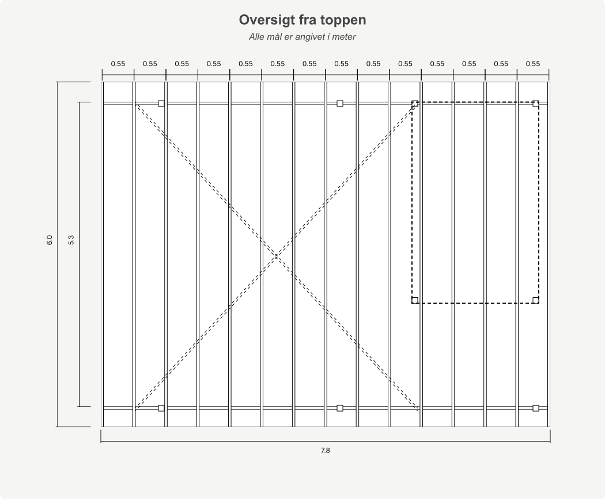
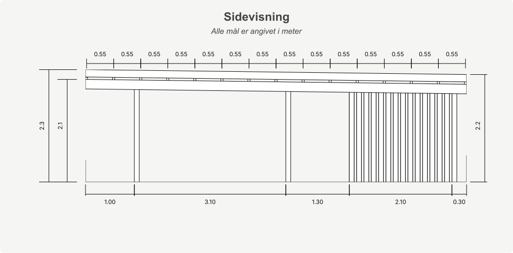

# 2nd Semester Exam Project – Datamatiker (Computer Science)

## Overview

This repository contains the 2nd semester exam project for the Datamatiker (Computer Science) program. The project was developed as a group and submitted together with a written report, followed by an individual oral defence.

---

## The Assignment

### The Case

The assignment is based on a real case provided by [Fog](https://www.johannesfog.dk/), a Danish timber and building supplies chain. Fog's existing system for handling custom carport orders was outdated, could not be maintained, and required sellers to work across multiple disconnected tools. The assignment was to design and build a replacement system that consolidates the sales workflow into a single web application — allowing customers to request a custom carport online, and sellers to manage offers, material lists, and orders in one place.

Requirements were derived from a recorded interview with a Fog employee, in which the current system and workflows were reviewed. This source material was made available during the exam period and is not publicly accessible.

> **Disclaimer:** This project was developed for educational purposes only. Fog is a real brand — all trademarks, brand assets, and business concepts referenced belong to their respective owners. This project is not affiliated with or endorsed by Fog in any way.

### Focus Points

- Requirements analysis and domain modelling, derived from a recorded customer interview with a Fog employee
- Automated calculation logic and dynamic SVG generation
- Agile development process with Scrum, Kanban, and GitHub Projects

### The Product

The two central pillars of the implementation were the material calculator (automated bill of materials and pricing) and the SVG drawer (dynamically generated per-carport technical drawings). The order flow is built around a strict separation of customer and seller access to data — including withholding the bill of materials until after payment. The drawings below are generated by the application based on customer-specified dimensions, and are designed to match Fog's own technical drawing format.

---

## Educational Context

- **Program:** Datamatiker (Computer Science, Academy Profession Degree)
- **Semester:** 2nd semester
- **Institution:** Erhvervsakademi København, Lyngby
- **Exam Type:** Group project with individual oral defence and written report
- **Completed:** December 2025, without the use of AI-generated code

---

## Experience Level at the Time

At the time this project was developed:
- We had approximately one year of programming experience each
- This was our first project built against a real business case

---

## Tech Stack

| Layer | Technology | Version |
|---|---|---|
| Language | Java | JDK 17 |
| Web Framework | Javalin | 6.1.3 |
| Build Tool | Apache Maven | 3.10.1 |
| Database | PostgreSQL | 16.2 |
| JDBC Driver | PostgreSQL JDBC Driver | 42.7.2 |
| Test Framework | JUnit | 5.10.2 |
| Template Engine | Thymeleaf | 3.1.2 |
| Frontend | HTML5, CSS3, JavaScript ES6 | — |
| Container | Docker | 28.5.1 |
| Reverse Proxy | Caddy | 2.7.6 |
| Hosting | DigitalOcean | — |
| Email Service | SendGrid | 4.10.3 |
| IDE | IntelliJ IDEA Ultimate | 2025.3 |
| Version Control | Git via GitHub | — |

---

## Contributors

- [Daniel Hangaard](https://github.com/dhangaard)
- [Morten Jensen](https://github.com/Mortenjenne)

---

## Project Report

The full project report is available in this repository: [report.pdf](report.pdf) *(Danish)*

---

## License

This project is licensed under the MIT License – see the [LICENSE](LICENSE) file for details.

> This repository is intended for educational and examination purposes only.
